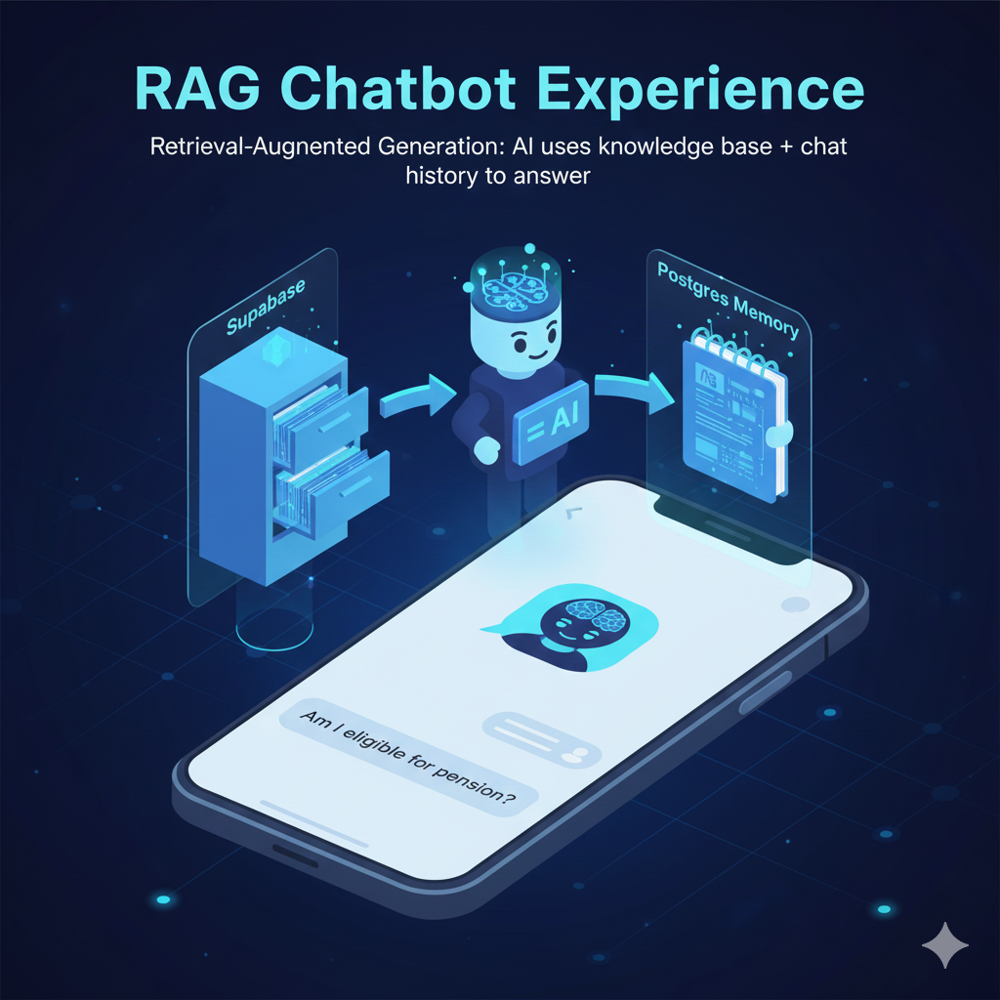

<div align="center">

# Veda - Social Welfare Web Application 🌍🤝

> **Note**: This is the official documentation and setup guide for the Social Welfare AI-Powered Platform.


## 📋 Overview

The **Social Welfare Web Application** is more than just a chatbot; it is a comprehensive **ecosystem** designed to centralize all welfare resources in one place. It serves as an intelligent bridge between complex government data and user queries, leveraging **realtime webscraping** to provide the most current information.


</div>

---

## ✨ Key Features

*   **🤖 AI-Powered Discovery**: Automatically finds relevant government schemes based on user demographics (Age, Income, Occupation).
*   **spider Automated Data Ingestion**: Uses **Crawl4AI** in **n8n** to intelligently crawl and extract clean content from complex government portals, handling dynamic JS rendering efficiently.
*   **💬 RAG Chatbot**: An intelligent assistant that uses **Retrieval-Augmented Generation** to answer user queries accurately using verified data.
*   **📊 Personalized Dashboard**: Users get a tailored view of schemes they are most likely to qualify for.
*   **🔒 Secure & Scalable**: built with modern security best practices and designed to handle high traffic.

<div align="center" style="display: flex; justify-content: center; gap: 20px; margin-top: 20px;">
  
  
</div>

---

## 🛠️ Tech Stack

| Component | Technology | Description |
| :--- | :--- | :--- |
| **Frontend** | React.js / Vite | Responsive user interface for citizens. |
| **Backend** | Node.js | Server-side JavaScript runtime. |
| **Automation** | **n8n** | Workflow orchestration for scraping and AI logic. |
| **Scraping** | **Crawl4AI** | High-performance async web crawling and scraping. |
| **Database** | **Supabase** | Vector store for AI embeddings and relational DB for user data. |
| **AI Models** | Ollama / OpenRouter | Powering the LLM and Embedding generation (e.g., `mimo-v2-flash`). |
| **Infrastructure** | Docker | Containerization for easy deployment. |

---

## 🚀 Getting Started

Follow these instructions to set up the project on your local device.

### Prerequisites

Ensure you have the following installed:
*   [Node.js](https://nodejs.org/) (v18+)
*   [Docker & Docker Compose](https://www.docker.com/)
*   [n8n](https://n8n.io/) (Self-hosted or Cloud)
*   [Supabase Account](https://supabase.com/)

### 📥 Installation Steps

#### 1. Clone the Repository
```bash
git clone https://github.com/yourusername/social-welfare-app.git
cd social-welfare-app
```

#### 2. Configure n8n Workflow
1.  Open your n8n dashboard (usually `http://localhost:5678`).
2.  **Import the Workflow**:
    *   Click on **"Add workflow"** in the top right.
    *   Click on the **three dots** (options menu) in the top right of the canvas.
    *   Select **"Import from file"**.
    *   Upload `SocialWelfare.json` from the project root.
3.  **Setup Credentials**:
    *   **Supabase API**: Enter your URL and Service Key.
    *   **OpenRouter / Ollama**: Configure your LLM provider keys.
4.  Activate the workflow.

#### 3. Setup Frontend
```bash
cd client
npm install
# Create a .env file with your API endpoints
npm run dev
```

#### 4. Database Setup
1.  Go to your Supabase project.
2.  Enable the `vector` extension.
3.  Create a `documents` table for storing embeddings (schema details in `docs/database.md`).

---

## 📖 Usage Guide

1.  **User Registration**: Open the web app and sign up. Fill in your profile details (Occupation: Farmer, Income: < 1L).
2.  **Wait for Analysis**: The system will trigger the n8n webhook. Wait for the notification "Schemes Found!".
3.  **Explore Schemes**: Browse the recommended list.
4.  **Ask Questions**: Click the "Chat Assistant" icon and ask, *"How do I apply for PM Kisan?"*.

---

## 🗺️ Roadmap & Future Features

*   [ ] **Multilingual Support**: Auto-translation for regional languages.
*   [ ] **Document Vault**: Secure upload for eligibility verification.
*   [ ] **SMS Notifications**: Offline alerts for rural users.
*   [ ] **Community Forum**: Peer-to-peer assistance.

---

## 🤝 Contributing

Contributions are welcome! Please fork the repo and submit a Pull Request.

## 📄 License

This project is licensed under the [MIT License](LICENSE).
