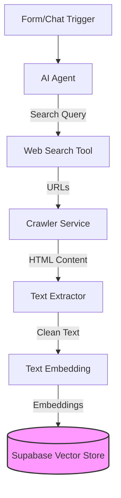
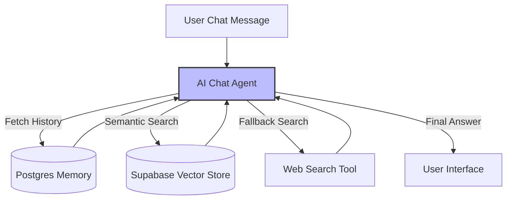

# Social Welfare Web Application & n8n Workflow Integration

## Overview
The **Social Welfare Web Application** is more than just a chatbot; it is a comprehensive **ecosystem** designed to centralize all welfare resources in one place. It serves as an intelligent bridge between complex government data and user queries, leveraging **realtime webscraping** to provide the most current information.

### Core Features
1.  **Smart User Onboarding**: Collects detailed user demographics (age, income, location, occupation) to create a precise eligibility profile.
2.  **Automated Intelligence**: Automatically searches the web for relevant schemes based on user data.
3.  **Data Ingestion**: Uses **Crawl4AI** to scrape verified government websites and portals to build a local knowledge base.
4.  **RAG Chatbot**: A Retrieval-Augmented Generation (RAG) chatbot that answers user queries using the scraped, verified data stored in the database.
5.  **Multilingual Support**: (Planned) Automatically translates scheme details into the user's native language.
6.  **Real-time Notifications**: (Planned) Alerts users via SMS/Email when a new scheme matching their profile is discovered.

### User Journey
1.  **Registration**: User signs up and completes a "Welfare Profile" form.
2.  **Analysis**: The system triggers the background n8n workflow to search for schemes matching the user's specific crtieria (e.g., "Farmers in Bangalore", "Students under 18").
3.  **Discovery**: The user is presented with a dashboard of "Recommended Schemes" ranked by relevance.
4.  **Interaction**: The user can chat with the AI assistant to ask specific questions like "How do I apply?" or "What documents are needed?" without leaving the platform.
5.  **Application**: The user follows the direct application links provided by the assistant.

---

## n8n Workflow Architecture
The core intelligence of the application is powered by an **n8n workflow** (`SocialWelfare.json`). This workflow handles two main responsibilities: **Data Ingestion** and **Conversational Querying**.

### 1. Data Ingestion Pipeline
This flow is triggered when a user submits their initial profile or a specific search query.

*   **Trigger**: `On form submission1` (Testing/Dev)
    *   *Note: This specific form trigger node is used for internal testing. In the production environment, this flow is initiated via the Chat UI webhook integration.*
    *   Receives the initial user query or profile data.
*   **Discovery (AI Agent)**:
    *   An AI Agent (powered by `xiaomi/mimo-v2-flash`) analyzes the input.
    *   **Tool**: `web_search` (HTTP Request to `host.docker.internal:8089/search`) finds relevant government URLs.
*   **Processing Loop**:
    *   The workflow loops through the discovered URLs.
    *   **Crawl**: Sends URLs to a local **Crawl4AI** service (`/crawl/job`) which handles efficient, asynchronous web scraping.
    *   **Wait & Check**: Waits for the crawl to complete and retrieves the HTML content.
    *   **Extract**: A JavaScript node extracts clean text from the HTML.
*   **Storage (Vector Database)**:
    *   The extracted text is embedded using `nomic-embed-text`.
    *   **Supabase Vector Store**: Stores the embeddings and metadata (URL, status) for future retrieval.

### 2. Conversational Chatbot (RAG)
This flow powers the interactive chat interface where users ask follow-up questions.

*   **Trigger**: `When chat message received`
*   **Contextual AI Agent**:
    *   Uses `Postgres Chat Memory` to remember previous interactions in the session.
    *   **Tool**: `supabase_search` allows the agent to query the vector database for the specific schemes scraped in the ingestion phase.
    *   **Tool**: `web_search` is also available for real-time fallback updates.
*   **Response**: The agent synthesizes the retrieved information into a user-friendly answer.

---

## Integration: How They Connect
The Web Application and n8n Workflow are tightly coupled via **Webhooks** and **Database**.

1.  **Frontend -> n8n (Ingestion)**: When a user signs up or enters a topic, the Frontend triggers the ingestion workflow (via webhook or chat integration). This initiates the search-and-scrape background job.
2.  **n8n -> Database**: The workflow populates the **Supabase** database with structured, embedded knowledge.
3.  **Frontend -> n8n (Chat)**: When a user types a message in the chat interface, the message is sent to the `when chat message received` webhook. The workflow retrieves context from Supabase and returns the AI-generated response directly to the frontend.

---

## Missing Important Features
To move this application from a prototype to a production-ready system, the following features should be implemented:

### 1. Security & Authentication
*   **Webhook Security**: Currently, the webhooks are open. Implement **API Key authentication** or specific **Header validation** (e.g., `X-App-Secret`) to ensure only your frontend can trigger workflows.
*   **User Data Privacy**: Ensure PII (Personally Identifiable Information) is filtered out before sending data to external LLMs or storing it in logs.

### 2. Robust Error Handling
*   **Dead Letter Queues**: If a crawl job fails or the vector store is unreachable, the data is currently lost or the workflow errors out. Implement a retry mechanism with exponential backoff and a "failed jobs" table in Supabase.
*   **Input Validation**: Add a schema validation node at the start of the workflow to reject malformed JSON payloads immediately.

### 3. User Feedback Loop
*   **Rating System**: Add a "Thumbs Up/Down" feature in the chat UI. Pass this feedback to a separate n8n workflow to flag poor responses or outdated vector data for manual review.
*   **Source Citations**: Modify the AI Agent prompt to strictly include the `url` from the metadata in its final response, so users can verify information (e.g., "According to [Scheme Details](https://...)").

### 4. Performance & Scalability
*   **Rate Limiting**: Prevent abuse by limiting the number of requests a single user IP can make to the webhooks per minute.
*   **Caching**: Implement a Redis cache layer for identical queries to save on LLM tokens and reduce latency.
*   **Queue Management**: Use RabbitMQ or similar to manage high volumes of crawl jobs during peak usage.

### 5. Advanced User Features (Roadmap)
*   **Document Vault**: A secure storage area where users can upload income certificates or ID proofs. The AI can then verified if these documents meet specific scheme requirements.
*   **Community Forum**: A space for beneficiaries to share their experiences and tips on getting approvals.
*   **Offline Mode**: An SMS-based query system for users in remote areas with poor internet connectivity.
